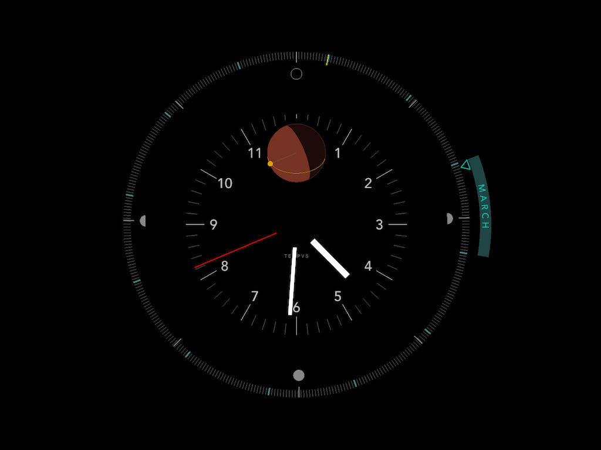
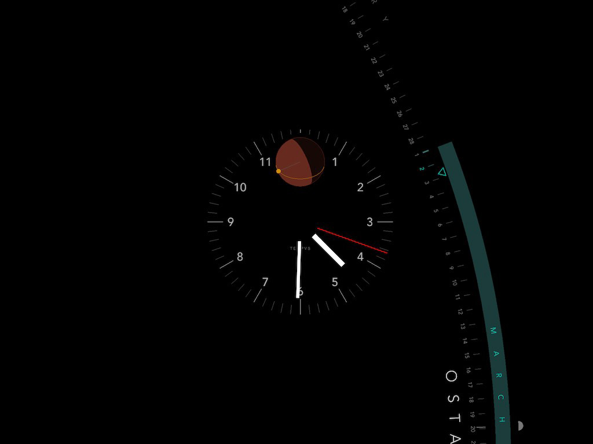

# T E M P V S

A clock and solar calendar screensaver.

Version 0.91 Beta  
© 2018-2021 S. Mason, All rights reserved. 
@vesabios on Twitter 

MacOS 10.9+ and Windows (only tested on windows 10, might work on others)

## Download 

<a id="raw-url" href="https://github.com/vesabios/tempus/blob/main/Release/Tempus_0.91.saver.zip?raw=true">Click here for the MacOS version</a>
 

<a id="raw-url" href="https://github.com/vesabios/tempus/blob/main/Release/Tempus_0.91.msi?raw=true">Click here for the Windows version</a>

## About Tempus 

This is a project I've been working on for a few years, starting out as a printed calendar that I made in 2017. The idea behind it is that I am personally more interested in time and its progression in different ways than we are generally shown in traditional clocks and calendars. To me, the biggest marker of the year is the length of the days, which is determined by the Earth's position around the sun (and the tilt, etc). Days are longer in the summer and shorter in the winter. More specifically, they are shortest on the Winter Solstice and longest on the Summer solstice, while the Autumn and Spring Equinoxes mark the halfway points where the days are getting shorter or longer, respectivaly, at the highest rate. I wanted to see a calendar where these changes in the amount of daylight we have are the primary axis of information being presented. This led me to want to see a calendar represented as a circle, with the solstices and other solar events driving the orientation of the design. 

As for the clock itself, it's fairly straightforward. It's good to just be able to read the time. However, I also really wanted to have an understanding of where the sun is at in the sky. The sunrise and sunset times change throughout the year, relative to where we are on the planet surface, etc. The clock visualizes this - the red dial in the middle shows an approximation of the earth. The center represents the configured latitude and longitude location. The yellow circle represents the sun and its orientation represents its position in the sky. The sun travels around the sphere as the day progresses, and its shadow can be seen. 

I started this project a few years ago and would load it up again basically once a year, around the new year, to work on it some more, but it took a long time to get everything to a point where I felt that the visual design was good enough, and then there was quite a bit more work to make it stable, fix memory leaks, optimize the rendering (still not that great really), build proper configuration panels, and finally to port the entire thing to windows (not to mention setting up this page). In any case it's a labor of love, I hope you enjoy it. Thanks!

### Additional Notes

- Enter your latitude and longitude to configure it for your geographic location. It comes pre-configured for San Francisco. (Note that this does not currently take into account DST.)
- Quarter and cross-quarter days (e.g. solstices, equinoxes) are shown around he interior. You can toggle between an alternate set of names for these, derived from ancient european names.
- The calendar year is drawn using a solar year  of 365.25 days, with the winter solstice always being at the 12 position. 
- The yellow line represents the calendar new year - January 1.
- The end of the year and the beginning of the year will not match up perfectly on the calendar wheel, with about an extra quarter day's worth of space. That's expected - this gap represents the extra time we have at the end of each year. Cumulatively, this adds up to a whole day every four years. Thus, leap years.

## Software

This software was written in C++ using <a href="https://libcinder.org/">Cinder</a>. It was written sporadically over a period of many years. 

## Release History

### 0.9
Initial beta release.

### 0.91
- Display and resolution bugs discovered and fixed after running on multiple machines
- Fixed preview window issue on Mac
- Initial Windows release!
- Cleaned up some culling logic

### MacOS
Runs on MacOS Version 10.9 (Mavericks) or higher. 

To install, open Tempus.saver by double clicking. It should install automatically, but you'll need to open up System Preferences and set it as your default screensaver for it to work.

### Windows
There is now a version for Windows as well. It's only been tested on Windows 10 so far.

To install, download the .msi file and double click on it. The extremely simple installer should copy it to your windows system32 or equivalent folder, which you don't need to worry about. To enable it, go do your display preferences and find the screen saver settings. NOTE: For some reason it doesn't render a preview in the little preview window, it just shows black. 

 

If you have trouble using it or installing it, I'm sorry!

THE SOFTWARE IS PROVIDED "AS IS", WITHOUT WARRANTY OF ANY KIND, EXPRESS OR IMPLIED, INCLUDING BUT NOT LIMITED TO THE WARRANTIES OF MERCHANTABILITY, FITNESS FOR A PARTICULAR PURPOSE, TITLE AND NON-INFRINGEMENT. IN NO EVENT SHALL THE COPYRIGHT HOLDERS OR ANYONE DISTRIBUTING THE SOFTWARE BE LIABLE FOR ANY DAMAGES OR OTHER LIABILITY, WHETHER IN CONTRACT, TORT OR OTHERWISE, ARISING FROM, OUT OF OR IN CONNECTION WITH THE SOFTWARE OR THE USE OR OTHER DEALINGS IN THE SOFTWARE.

