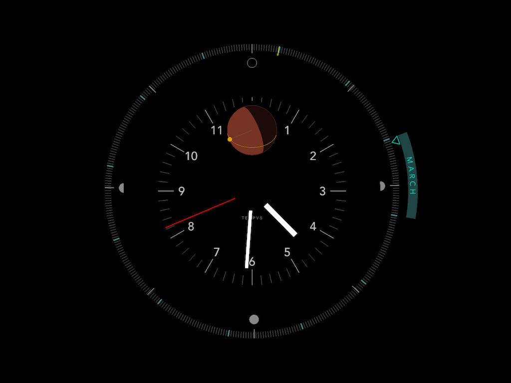
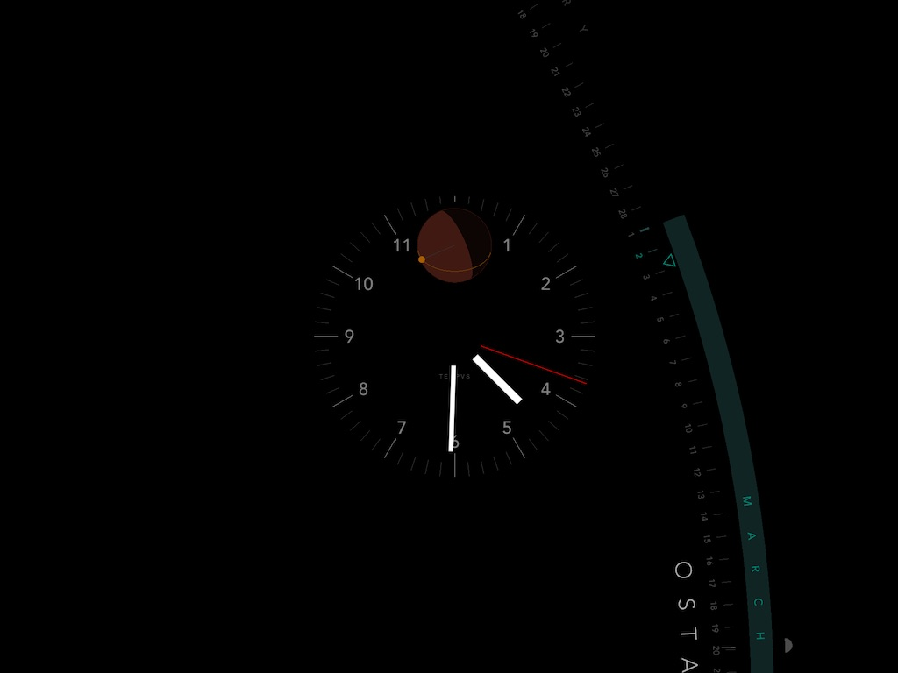

# T E M P V S

A clock and solar calendar screensaver.

Version 0.9 Beta  
© 2018-2021 S. Mason, All rights reserved.

## Presentation 

- The clock is a straightfoward 12-hour clock.
- The outer ring is a representation of the solar year. It is oriented such that the winter solstice is at the top, the summer solstice is at the bottom, and the equinoxes are on the sides. The ring will periodically zoom in and out to show you the current day within the month, shown as a triangular dial indicator. 
- The red dial in the middle shows an approximation of the earth. The center represents the configured latitude and longitude location. The yellow circle represents the sun and its orientation represents its position in the sky. The sun travels around the sphere as the day progresses, and its shadow can be seen in the visualization.
- Enter your latitude and longitude to configure it for your geographic location. It comes pre-configured for San Francisco. (Note that this does not currently take into account DST.)
- Quarter and cross-quarter days (e.g. solstices, equinoxes) are shown around he interior. You can toggle between an alternate set of names for these, derived from ancient european names.
- The calendar year is drawn using a solar year  of 365.25 days, with the winter solstice always being at the 12 position. 
- The yellow line represents the new calendar year - January 1.
- The end of the year and the beginning of the year will not match up perfectly on the calendar wheel, with about an extra quarter day's worth of space. That's expected - this gap represents the extra time we have at the end of each year. Cumulatively, this adds up to a whole day every four years. Thus, leap years.

## Software

This software was written in C++ using <a href="https://libcinder.org/">Cinder</a>. It was written sporadically over a period of many years. The code is garbage and needs to be refactored. 

It is compiled for MacOS Version 10.7 or higher. There is a Windows version coming at some point.

It uses OpenGL and is not optimized, and I make no guarantees about whether or not it will heat up your GPU. 

If you have trouble using it or installing it, I'm sorry - I'm not a hardcore app developer by trade.

THE SOFTWARE IS PROVIDED "AS IS", WITHOUT WARRANTY OF ANY KIND, EXPRESS OR IMPLIED, INCLUDING BUT NOT LIMITED TO THE WARRANTIES OF MERCHANTABILITY, FITNESS FOR A PARTICULAR PURPOSE, TITLE AND NON-INFRINGEMENT. IN NO EVENT SHALL THE COPYRIGHT HOLDERS OR ANYONE DISTRIBUTING THE SOFTWARE BE LIABLE FOR ANY DAMAGES OR OTHER LIABILITY, WHETHER IN CONTRACT, TORT OR OTHERWISE, ARISING FROM, OUT OF OR IN CONNECTION WITH THE SOFTWARE OR THE USE OR OTHER DEALINGS IN THE SOFTWARE.

